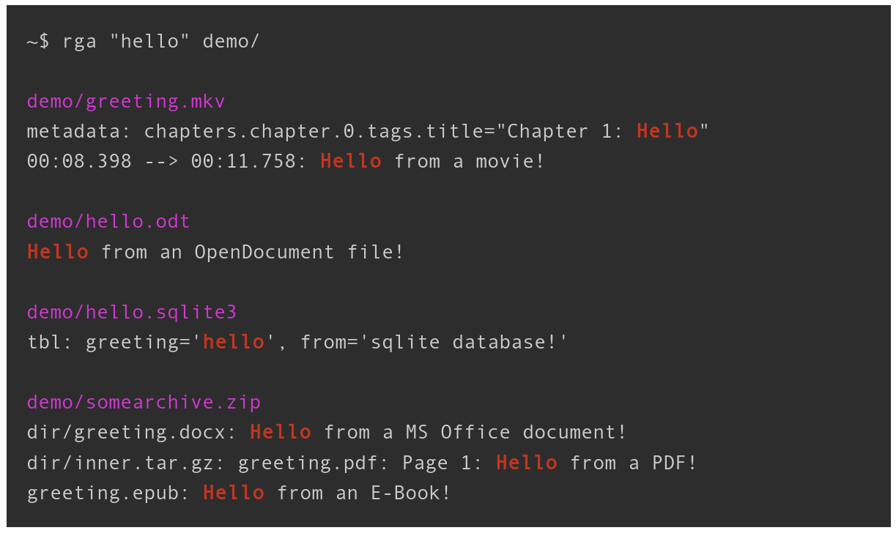

# rga: ripgrep, but also search in PDFs, E-Books, Office documents, zip, tar.gz, etc.

rga is a line-oriented search tool that allows you to look for a regex in a multitude of file types. rga wraps the awesome [ripgrep] and enables it to search in pdf, docx, sqlite, jpg, movie subtitles (mkv, mp4), etc.

[ripgrep]: https://github.com/BurntSushi/ripgrep

[](https://github.com/phiresky/ripgrep-all)
[](https://crates.io/crates/ripgrep-all)
[](https://www.reddit.com/r/rustjerk/top/?sort=top&t=all)

For more detail, see this introductory blogpost: https://phiresky.github.io/blog/2019/rga--ripgrep-for-zip-targz-docx-odt-epub-jpg/

rga will recursively descend into archives and match text in every file type it knows.

Here is an [example directory](https://github.com/phiresky/ripgrep-all/tree/master/exampledir/demo) with different file types:

```
demo/
├── greeting.mkv
├── hello.odt
├── hello.sqlite3
└── somearchive.zip
├── dir
│ ├── greeting.docx
│ └── inner.tar.gz
│ └── greeting.pdf
└── greeting.epub
```



## Integration with fzf


See [the wiki](https://github.com/phiresky/ripgrep-all/wiki/fzf-Integration) for instructions of integrating rga with fzf.

## INSTALLATION

Linux x64, macOS and Windows binaries are available [in GitHub Releases][latestrelease].

[latestrelease]: https://github.com/phiresky/ripgrep-all/releases/latest

### Linux

#### Arch Linux

`pacman -S ripgrep-all`

#### Nix

`nix-env -iA nixpkgs.ripgrep-all`

#### Debian-based

download the [rga binary][latestrelease] and get the dependencies like this:

`apt install ripgrep pandoc poppler-utils ffmpeg`

If ripgrep is not included in your package sources, get it from [here](https://github.com/BurntSushi/ripgrep/releases).

rga will search for all binaries it calls in \$PATH and the directory itself is in.

### Windows

Note that installing via [chocolatey](https://chocolatey.org/packages/ripgrep-all) or [scoop](https://github.com/ScoopInstaller/Main/blob/master/bucket/rga.json) is the only supported download method. If you download the binary from releases manually, you will not get the dependencies (for example pdftotext from poppler).

If you get an error like `VCRUNTIME140.DLL could not be found`, you need to install [vc_redist.x64.exe](https://support.microsoft.com/en-us/help/2977003/the-latest-supported-visual-c-downloads).

#### Chocolatey

```
choco install ripgrep-all
```

#### Scoop

```
scoop install rga
```

### Homebrew/Linuxbrew

`rga` can be installed with [Homebrew](https://formulae.brew.sh/formula/ripgrep-all#default):

`brew install rga`

To install the dependencies that are each not strictly necessary but very useful:

`brew install pandoc poppler ffmpeg`

### MacPorts

`rga` can also be installed on macOS via [MacPorts](https://ports.macports.org/port/ripgrep-all/):

`sudo port install ripgrep-all`

### Compile from source

rga should compile with stable Rust (v1.75.0+, check with `rustc --version`). To build it, run the following (or the equivalent in your OS):

```
~$ apt install build-essential pandoc poppler-utils ffmpeg ripgrep cargo
~$ cargo install --locked ripgrep_all
~$ rga --version    # this should work now
```

## Available Adapters

rga works with _adapters_ that adapt various file formats. It comes with a few adapters integrated:

```
rga --rga-list-adapters
```

You can also add **custom adapters**. See [the wiki](https://github.com/phiresky/ripgrep-all/wiki) for more information.

<!-- this part generated by update-readme.sh -->

Adapters:

- **pandoc**
  Uses pandoc to convert binary/unreadable text documents to plain markdown-like text
  Runs: pandoc --from= --to=plain --wrap=none --markdown-headings=atx  
   Extensions: .epub, .odt, .docx, .fb2, .ipynb, .html, .htm

- **poppler**
  Uses pdftotext (from poppler-utils) to extract plain text from PDF files
  Runs: pdftotext - -  
   Extensions: .pdf  
   Mime Types: application/pdf

- **postprocpagebreaks**
  Adds the page number to each line for an input file that specifies page breaks as ascii page break character.
  Mainly to be used internally by the poppler adapter.  
   Extensions: .asciipagebreaks

- **ffmpeg**
  Uses ffmpeg to extract video metadata/chapters, subtitles, lyrics, and other metadata  
   Extensions: .mkv, .mp4, .avi, .mp3, .ogg, .flac, .webm

- **zip**
  Reads a zip file as a stream and recurses down into its contents  
   Extensions: .zip, .jar  
   Mime Types: application/zip

- **decompress**
  Reads compressed file as a stream and runs a different extractor on the contents.  
   Extensions: .als, .bz2, .gz, .tbz, .tbz2, .tgz, .xz, .zst  
   Mime Types: application/gzip, application/x-bzip, application/x-xz, application/zstd

- **tar**
  Reads a tar file as a stream and recurses down into its contents  
   Extensions: .tar

- **sqlite**
  Uses sqlite bindings to convert sqlite databases into a simple plain text format  
   Extensions: .db, .db3, .sqlite, .sqlite3  
   Mime Types: application/x-sqlite3

The following adapters are disabled by default, and can be enabled using '--rga-adapters=+foo,bar':

- **mail**
  Reads mailbox/mail files and runs extractors on the contents and attachments.  
   Extensions: .mbox, .mbx, .eml  
   Mime Types: application/mbox, message/rfc822

## USAGE:

> rga \[RGA OPTIONS\] \[RG OPTIONS\] PATTERN \[PATH \...\]


## FLAGS:

**\--rga-accurate**

> Use more accurate but slower matching by mime type

> By default, rga will match files using file extensions. Some programs,
> such as sqlite3, don\'t care about the file extension at all, so users
> sometimes use any or no extension at all. With this flag, rga will try
> to detect the mime type of input files using the magic bytes (similar
> to the \`file\` utility), and use that to choose the adapter.
> Detection is only done on the first 8KiB of the file, since we can\'t
> always seek on the input (in archives).

**\--rga-no-cache**

> Disable caching of results

> By default, rga caches the extracted text, if it is small enough, to a
> database in \${XDG_CACHE_DIR-\~/.cache}/ripgrep-all on Linux,
> _\~/Library/Caches/ripgrep-all_ on macOS, or
> C:\\Users\\username\\AppData\\Local\\ripgrep-all on Windows. This way,
> repeated searches on the same set of files will be much faster. If you
> pass this flag, all caching will be disabled.

**-h**, **\--help**

> Prints help information

**\--rga-list-adapters**

> List all known adapters

**\--rga-print-config-schema**

> Print the JSON Schema of the configuration file

**\--rg-help**

> Show help for ripgrep itself

**\--rg-version**

> Show version of ripgrep itself

**-V**, **\--version**

> Prints version information

## OPTIONS:

**\--rga-adapters=**\<adapters\>\...

> Change which adapters to use and in which priority order (descending)

> \"foo,bar\" means use only adapters foo and bar. \"-bar,baz\" means
> use all default adapters except for bar and baz. \"+bar,baz\" means
> use all default adapters and also bar and baz.

**\--rga-cache-compression-level=**\<compression-level\>

> ZSTD compression level to apply to adapter outputs before storing in
> cache db

> Ranges from 1 - 22 \[default: 12\]

**\--rga-config-file=**\<config-file-path\>

**\--rga-max-archive-recursion=**\<max-archive-recursion\>

> Maximum nestedness of archives to recurse into \[default: 5\]

**\--rga-cache-max-blob-len=**\<max-blob-len\>

> Max compressed size to cache

> Longest byte length (after compression) to store in cache. Longer
> adapter outputs will not be cached and recomputed every time.

> Allowed suffixes on command line: k M G \[default: 2000000\]

**\--rga-cache-path=**\<path\>

> Path to store cache db \[default: /home/phire/.cache/ripgrep-all\]

**-h** shows a concise overview, **\--help** shows more detail and
advanced options.

All other options not shown here are passed directly to rg, especially
\[PATTERN\] and \[PATH \...\]

<!-- end of part generated by update-readme.sh -->

## Config
The config file location leverage the mechanisms defined by
- the [XDG base directory](https://standards.freedesktop.org/basedir-spec/basedir-spec-latest.html) and
  the [XDG user directory](https://www.freedesktop.org/wiki/Software/xdg-user-dirs/) specifications on Linux (ex: `~/.config/ripgrep-all/config.jsonc`)
- the [Known Folder](https://msdn.microsoft.com/en-us/library/windows/desktop/dd378457.aspx) API on Windows (ex:  `C:\Users\Alice\AppData\Roaming\ripgrep-all/config.jsonc`)
- the [Standard Directories](https://developer.apple.com/library/content/documentation/FileManagement/Conceptual/FileSystemProgrammingGuide/FileSystemOverview/FileSystemOverview.html#//apple_ref/doc/uid/TP40010672-CH2-SW6)
  guidelines on macOS (ex: `~/Library/Application Support/ripgrep-all/config.jsonc`)


## Development

To enable debug logging:

```bash
export RUST_LOG=debug
export RUST_BACKTRACE=1
```

Also remember to disable caching with `--rga-no-cache` or clear the cache
(`~/Library/Caches/rga` on macOS, `~/.cache/rga` on other Unixes,
or `C:\Users\username\AppData\Local\rga` on Windows)
to debug the adapters.

### Nix and Direnv

You can use the provided [`flake.nix`](./flake.nix) to setup all build- and
run-time dependencies:

1. Enable [Flakes](https://wiki.nixos.org/wiki/Flakes) in your Nix configuration.
1. Add [`direnv`](https://direnv.net/) to your profile:
   `nix profile install nixpkgs#direnv`
1. `cd` into the directory where you have cloned this directory.
1. Allow use of [`.envrc`](./.envrc): `direnv allow`
1. After the dependencies have been installed, your shell will now have all of
   the necessary development dependencies.
